# STREAMSTEIN
A cross-platform Electron Desktop App to stream and download any Movie, TV Series or Anime in the World. Zero Ads and Tracking. An improved version of Streambert by truelockmc.<br></br>
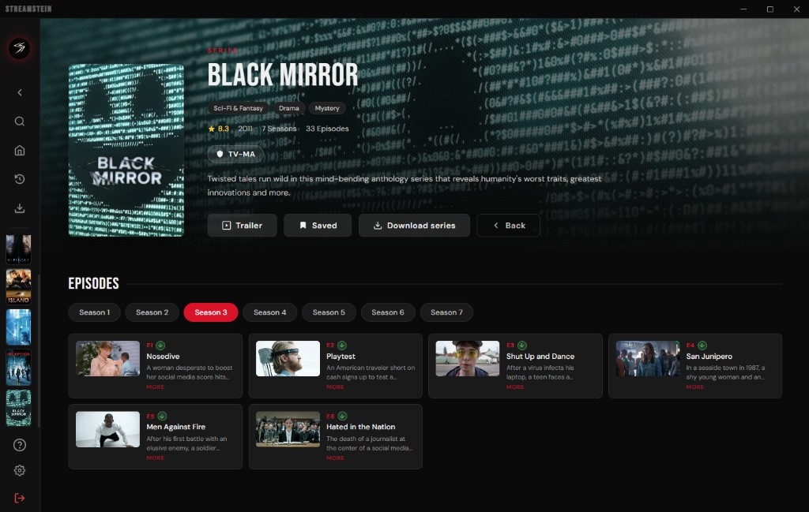
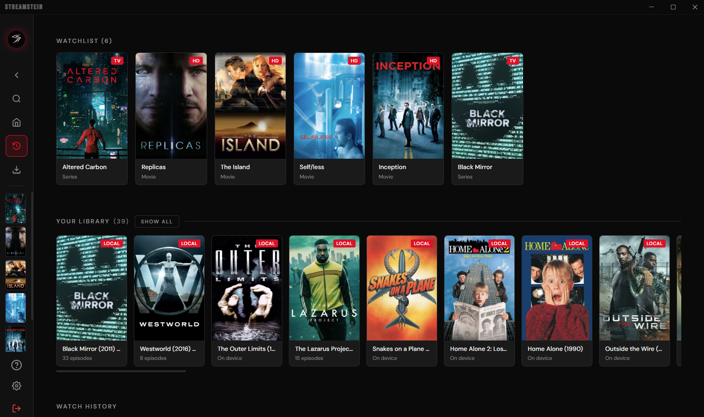
</br>
[Installation](https://github.com/CodeUpdaterBot/StreamStein?tab=readme-ov-file#requirements)

## Why StreamStein?
- 🎦 **Any** Movie, Anime or TV Series from around the World.
- 📥 **Stream or Download** anything you want to watch, one movie or entire show at a time.
- 📚 **Local Library** to track & save what you watched and manage your Downloads.
- ⚙️ **Customize** the Interface and Features to your unique needs.
- 🛡️ **No Add** Completely Ads and Tracker free, forever.
- ⚡ **Speed:** Stream faster than any Browser can.

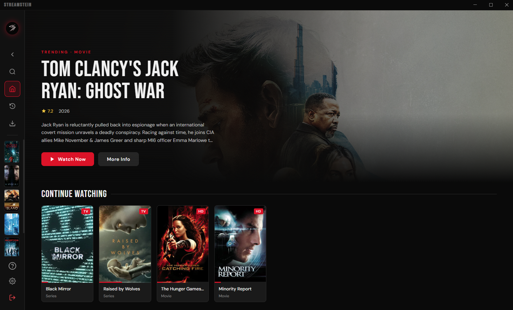
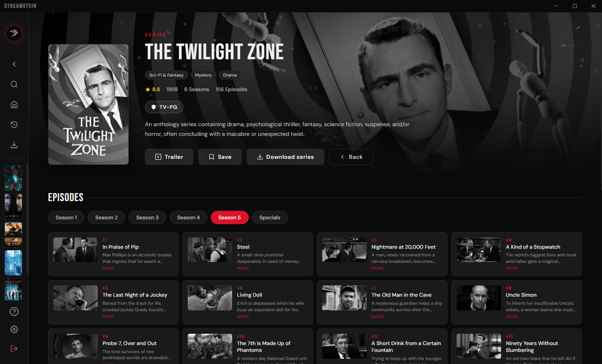
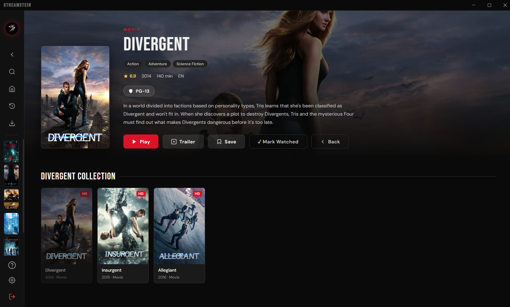
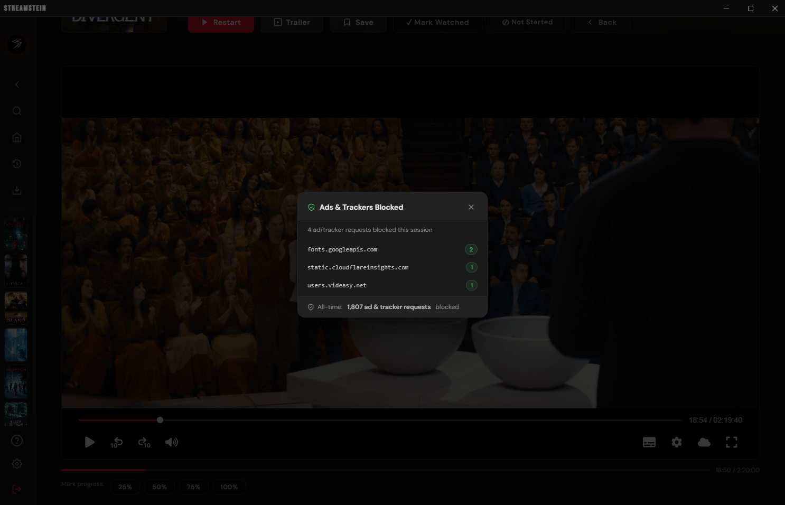
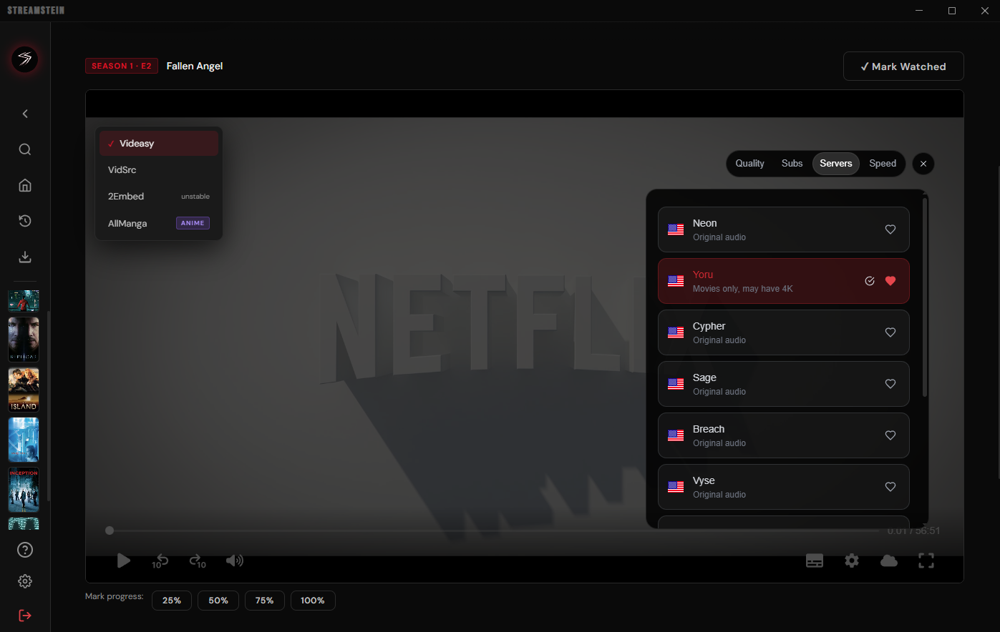
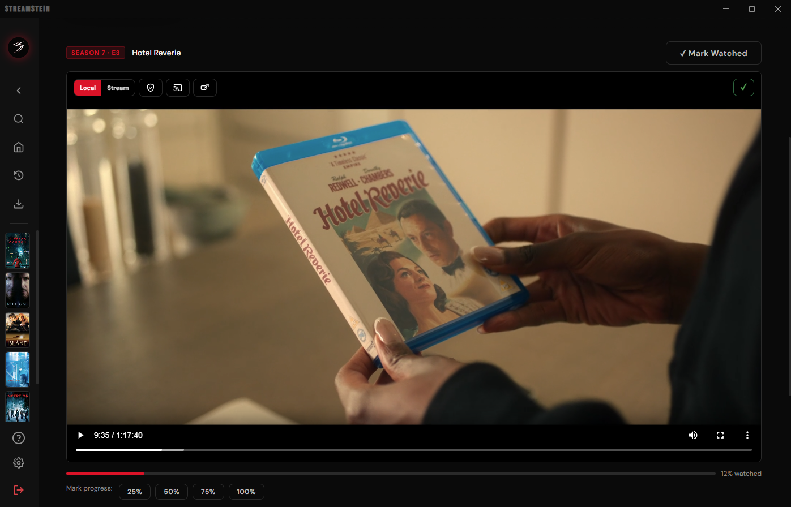
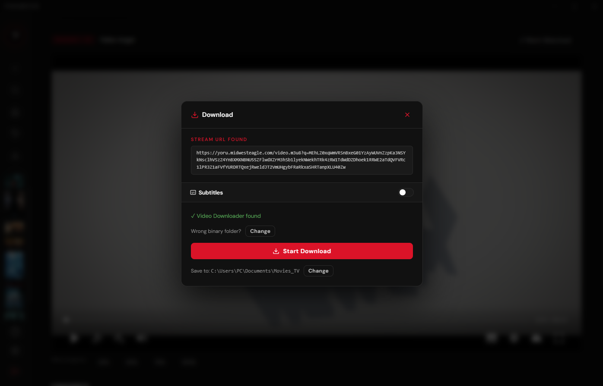
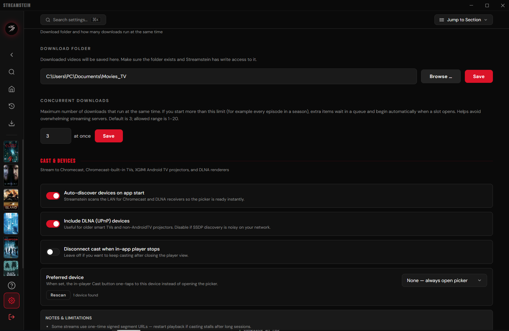
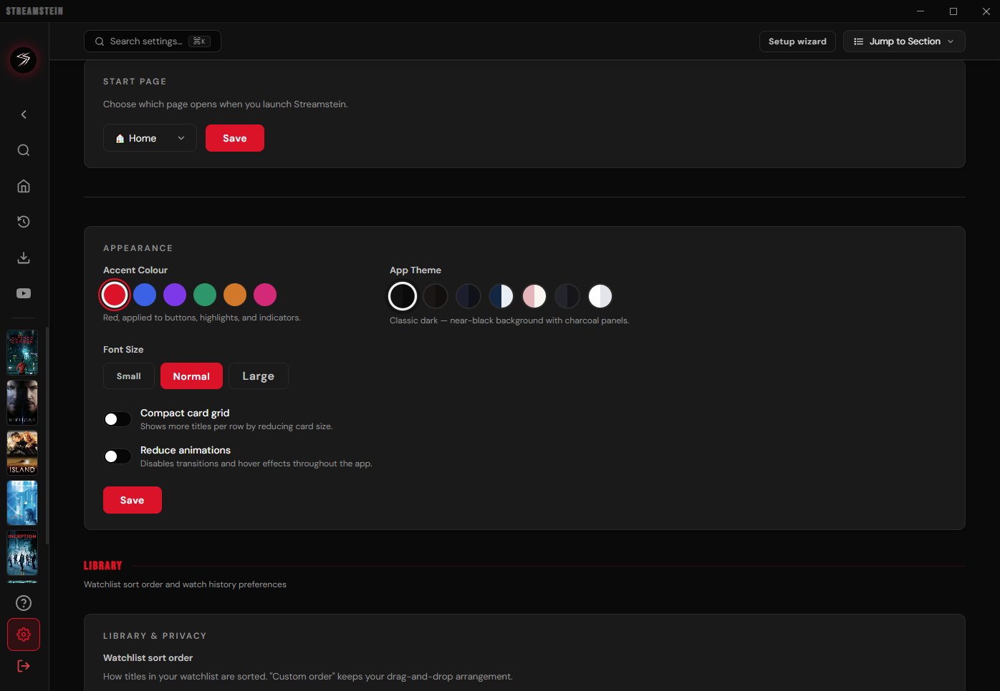

---
## Streaming & Downloading
The Application mainly gets Video Streams from VidEasy & VidSrc (you can also Stream from 2Embed). It fetches Information for Images, Info Texts, Search and Homepage from [tmdb](https://www.themoviedb.org/). You can download those Video Streams because the Program sources Links to their .m3u8 Playlist Files.<br></br>
Once you click 'Download' these Links are used to download the Full Movie/TV Episode using [this Program](https://github.com/CodeUpdaterBot/vid-dl-cli-only). You can then watch them In-App or take the Files on any Storage Medium you want.

---

## Requirements
- [Node.js](https://nodejs.org/) (>=22.12.0) installed
- A free TMDB API Read Access Token ([Guide on how to get one](tmdb-tutorial.md))
- [ffmpeg](https://ffmpeg.org/download.html) Make sure to put ffmpeg.exe, ffplay.exe, and ffprobe.exe files into the root/main parent folder of StreamStein
- For downloading, [this Program](https://github.com/CodeUpdaterBot/vid-dl-cli-only/releases/latest) somewhere on your PC (can select folder in STREAMSTEIN)

---
## Easy Installation (Windows-only)
- Download the latest .exe from the Releases section of this GitHub repo

## Installation from Source (Cross-platform)
- Download the code from this repo and follow the below commands to build it from source.

- Either way, upon first launch you'll be prompted to enter your TMDB API key. ([Guide on how to get one](tmdb-tutorial.md))
It's saved locally, you only need to do this once, just do it now so everythign loads/populates correctly.

---

## Building from Source
0. cd your terminal to the StreamStein folder you downloaded (not the .zip, the un-zipped folder)
1. Install dependencies:
```bash
npm install
```
2. Build & launch
```bash
npm start
```
3. Build for Production
```bash
npm run dist:win
```
or
```bash
npm run dist:linux
```
or (for Arch Linux)
```bash
npm run dist:arch
```
or (for an AppImage only)
```bash
npm run dist:appimage
```

> [!IMPORTANT]
> If you are building/installing on Arch Linux and encounter errors, you may need these libraries:
> - **libcrypt.so.1 error:** `sudo pacman -S libxcrypt-compat`
> - **http-parser dependency error:** `yay -S http-parser` (from AUR)


## Anime
You can also watch Anime, the App checks if a Movie or Series is an Anime and then sources its Metadata from [AniList](https://anilist.co/) instead of [tmdb](https://www.themoviedb.org/). <br></br>
Media Files for Animes are scraped from AllManga.to (original technique from [ani-cli](https://github.com/pystardust/ani-cli)). The App directly gets .mp4 Files and doesnt even show you the AllManga website, you can also download these Files, just like any other Content.
## Legal Disclaimer

**IMPORTANT: This application is for educational and personal use only.**

- Streamstein does not host, store, or distribute any copyrighted content
- All content is sourced from third-party providers and websites
- Users are solely responsible for ensuring they have legal rights to access any content
- The developer does not endorse or encourage copyright infringement
- Users must comply with all applicable laws in their jurisdiction
- Any legal issues should be directed to the actual content providers
- This app functions as a search engine aggregator only
- No copyrighted material is stored on my side

## Legal Notice

This application is provided "as is" for educational purposes. The developer:
- Does not claim ownership of any content
- Does not profit from copyrighted material in any way
- Does not control third-party content providers
- Encourages users to support content creators through legal means

[](https://repostars.dev/?repos=CodeUpdaterBot%2Fstreamstein&theme=dark)
